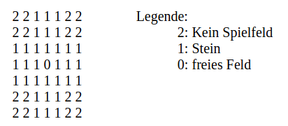
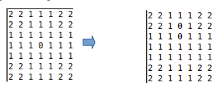

# **not working currently **

<!-- TABLE OF CONTENTS -->

  
<h2 style="display: inline-block">Inhaltsverzeichnis</h2>

  <ol>
    <li>
      <a href="#initialisierung-der-matrix ">Initialisierung der Matrix</a>
    </li>
    <li>
      <a href="#allgemeine-beschreibung-des-algorithmus">Allgemeine Beschreibung des Algorithmus</a>
    </li>
    <li>
      <a href="#genauere-beschreibung">Genauere Beschreibung</a>
    </li>
    <li>
      <a href="#Error">Error</a>
    </li>
        <li>
      <a href="#konsolenausgabe">Konsolenausgabe</a>
    </li>
  </ol>

### Übersicht
Algorithmus um alle Lösungswege des Brettspielsspiels "Solitär" (Peg solitaire) zu finden.

[Wikipedia Artikel: Solitär](https://de.wikipedia.org/wiki/Solit%C3%A4r_(Brettspiel))

### Initialisierung der Matrix 
Die Matrix wird durch eine “.txt” Datei eingelesen. Es ist auch möglich andere Positionen oder
andere Solitär-Spielbretter als Initialmatrix zu verwenden. (mit Anpasssung des Figurenzählers)

### Allgemeine Beschreibung des Algorithmus
Um die Lösung zu finden, wurde eine rekusive Tiefensuche implementiert. Die Baumstruktur wird
hierbei, aber durch verkettete Listen mit dem “FIFO(First In First Out) Prinzip” dargestellt. Jeder
ausgeführte Zug stellt dabei einen Knoten dar.

- Es werden von der Initialmatrix alle möglichen Züge durchlaufen.
- Es wird geprüft, ob das Spiel gewonnen wurde (Spielsteine=1 & Spielstein genau in der Mitte)
    - Wenn ja, wird der Gewinn-Pfad ausgegeben (Zug-Historie)
    - Wenn nein, wird geprüft ob der aktuelle Knoten noch verfügbare Züge hat.
      - Wenn nein, wird der aktuelle Zug rückgängig gemacht.
      - Wenn ja, dann wird der nächstmögliche Zug ausgeführt.

### Genauere Beschreibung
**3 eigene Typen:**

- moveCoordinates: 
  - Enthält 3 Arrays mit 2 Feldern, welche die Start-,Sprung-, Endposition darstellen
  Bsp. Erster Zug [[4,2],[4,3],[4,4]]
      

- possibleMovesList: 
  - Ist ein Knoten einer verketteten Liste: Er enthält ebenso 3 Arrays mit 2 Feldern,
  welche die Start-,Sprung-, Endposition darstellen und einen Pointer, der auf den nächstmöglichen
  Zug(Knoten) zeigt.

- nodeExecutedMoves:
  - Den nächsten Zug (Pointer auf den nächsten Knoten)
  - Alle Möglichen Züge der aktuellen Position, welche noch nicht durchlaufen sind. (Pointer auf
  possibleMovesList)
  - Aktuellen Zugkoordinaten (moveCoordinates)

Die Grund-Idee ist, für jeden Zug einen Knoten (nodeExecutedMoves) zu haben und die Matrix
fortlaufend mit zuverändern.
Jeder Knoten enthält eine Liste von allen möglichen Zügen der Postition, welche noch nicht
abgelaufen wurden.

Der erste Knoten aus der möglichen-Zug-Liste (possibleMovesList) wird ausgeführt und aus der
Liste gelöscht.
Dieser bildet den nächsten Knoten in der Ausgeführten-Zug-Liste (nodeExecutedMoves). Der
ausgeführte Zug wird als neuer Kopf (Head) der “nodeExecutedMoves” Liste gesetzt. Für die neue
Position werden wieder alle möglichen Züge (addAllPossibleMovesToList) berechnet und als Liste
an den Knoten gegeben.
Falls der neue Knoten kein Element in der possibleMovesList besitzt, wird der aktuelle Zug
rückgängig gemacht (jumpBack). Das heißt, er wird auch aus der “nodeExecutedMoves” Liste
entfernt.

Die aktuelle Anzahl an Spielfiguren wird kontinuierlich mitgezählt. Falls diese 1 ist und der letzte
Stein in der Mitte also Position (4,4) liegt, gilt das Spiel als gewonnen. Es wird von jedem Konten
in “nodeExecutedMoves” der aktuelle Zug ausgegeben, was den Gewinn-Zug-Pfad widerspiegelt.

### Error
Der beschriebener Brute Force Algorithmus funktioniert mit Postionen mit weniger Figuren, aber
leider nicht mit allen 32. Da dieser eine zu lange Laufzeit hat. In der Abgabe kann das Programm
ausgeführt werden und gibt den Lösungspfad aus, aber läuft nur mit der Matrix ‘testSoli.txt’mit
11 Spielsteinen.

Daher habe ich eine Optimierung versucht:
Diese basiert darauf, dass man die aktuelle Matrix auf gespeicherte, nicht lösbare Matrizen
vergleicht und auch dadurch Berechnungen spart.

Immer, wenn eine Postion erreicht wird, welche nicht lösbar ist (keine möglichen Züge oder alle
Züge abgelaufen), wird die Matrix in einer Liste gespeichert. Aus der nicht lösbaren Matrix werden
außerdem alle 7 weiteren kongruenten Matrizen generiert und gespeichert, welche auch nicht lösbar
sind.(4x um 90 Grad gedreht und alle transponierten Matrizen davon)

Leider gibt es in dieser Optimierung einen Error, welchen ich nicht debugen konnte. Es wird der
Zähler der Spielsteine an irgendeinen Zeitpunkt um 1 erhöht. Der Optimierungscode ist daher im
Suchalgorithmus auskommentiert.

### Konsolenausgabe

**Legende Ausgabe: Aufbau ‘solution path’:**\
[[(Startkoordinate)(Sprung-)(End-)],…]

**Example solution path:**\
[(4,2), (4,3), (4,4)], [(4,5), (4,4), (4,3)], [(2,5), (3,5), (4,5)], [(2,3), (2,4), (2,5)],
[(6,4), (5,4), (4,4)], [(5,6), (5,5), (5,4)], [(5,3), (5,4), (5,5)], [(3,4), (4,4), (5,4)],
[(5,4), (5,5), (5,6)], [(4,3), (3,3), (2,3)]